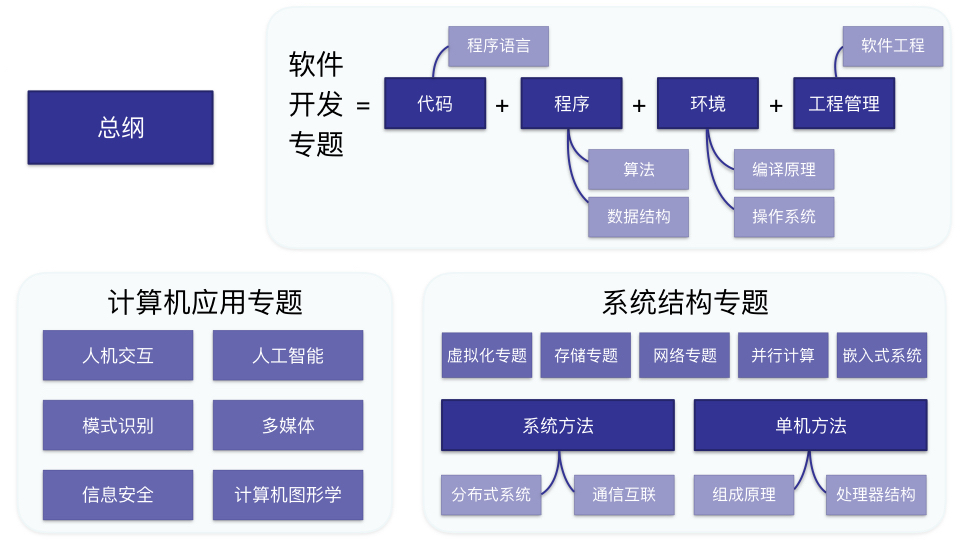

# 计算机学科知识梳理
#### by Zhao Zhenlong
---

### 总纲
+ 从图灵计算理论和冯诺依曼体系结构出发
	+ 硬件路线 计算机 = 执行 + 状态
	+ 软件路线 软件 = 代码 + 程序 + 环境 + 工程管理
	+ 如何划分软硬件
		+ 指令集和系统软件
+ 与系统方法整合
	+ 系统方法
	+ 通信、互联、协同
		+ 单机方法
+ 计算机应用

### 软件开发专题
+ 软件开发 =  代码 + 程序 + 环境 + 工程管理
	+ 代码 程序语言
	+ 程序 = 算法 + 数据
		+ 算法
		+ 数据结构
	+ 环境 系统软件
		+ 编译原理
		+ 操作系统
		+ 配置运维
	+ 工程管理 软件工程

### 系统结构专题
+ **单机方法**
	+ 计算机组成原理
	+ 处理器结构
+ **系统方法**
	+ 通信和互联
	+ 分布式系统
+ 方法应用
	+ **虚拟化专题**
	+ **网络专题**
	+ **存储专题**
	+ *并行计算*
	+ *嵌入式系统*

	
### 计算机应用专题
+ *人机交互*
+ *人工智能*
+ *模式识别*
+ *多媒体*
+ *信息安全*
+ *计算机图形学*